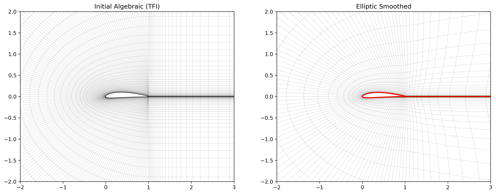
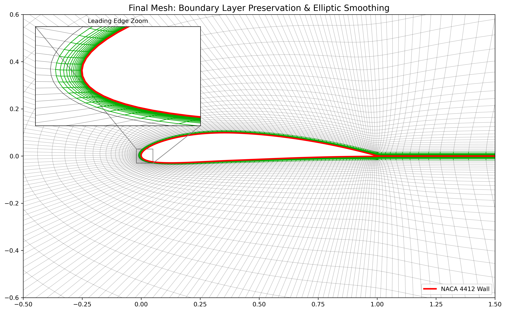

# Mesh Generation code

## Project Overview
This project demonstrates the implementation of fundamental mesh generation algorithms required for high-fidelity CFD simulations, specifically targeting the generation of **C-Meshes for Airfoils** using hybrid Algebraic-Elliptic methods.

## Capabilities
1.  **Airfoil Geometry Generation**: Parametric generation of NACA 4-digit series airfoils (Abbott & Von Doenhoff).
2.  **Algebraic Grid Generation (TFI)**: Rapid generation of initial C-topology grids using Transfinite Interpolation.
3.  **Elliptic Smoothing (Winslow)**: Improvement of mesh quality (smoothness and orthogonality) by solving Poisson-type elliptic equations.
4.  **Boundary Layer Preservation**: Implementation of a "frozen layer" technique to maintain high-quality orthogonal cells near the wall, crucial for capturing viscous effects ($y^+$ requirements).

## Mathematical Foundation
The mesh generation pipeline follows the classical approach:
1.  **Algebraic Initialization**: $ \vec{r}(\xi, \eta) = \text{TFI}(\partial \Omega) $
2.  **Elliptic Smoothing**: Solving $\nabla^2 \xi = 0$ and $\nabla^2 \eta = 0$ inverted to physical space to smooth the internal grid lines while freezing near-wall metrics.

*See `MATH_AND_REFERENCES.md` for detailed equations and code mappings.*

## Visual Results

### 1. TFI vs. Elliptic Smoothing
*Left: The initial algebraic mesh showing typical skewness. Right: The smoothed mesh (black) with the preserved boundary layer (green) showing improved orthogonality.*


### 2. Boundary Layer Detail (Leading Edge)
*Zoomed view of the leading edge, demonstrating how the "frozen layer" technique maintains high-quality orthogonal cells near the wall ($y^+$ preservation) even while smoothing the outer domain.*


## Usage
Run the main script to generate a mesh for a NACA 4412 airfoil:
```bash
python tfi_finaly.py
```
This will:
- Generate an initial TFI mesh.
- Smooth the outer field using 100 iterations of the Winslow smoother.
- Export the mesh to `final_mesh.csv`.
- Display and save a comparison plot and a zoomed leading-edge view.

## Future Scope 
1.  **Curved Elements**: Extension to $P^2$ or $P^3$ curvilinear elements to support High-Order DG methods.
2.  **Metric-Based Adaptation**: Replacing the uniform Laplacian smoothing with Riemannian Metric tensors ($\mathcal{M}$) derived from the Hessian of the flow solution (Mach, Density) to drive automatic adaptation.

## References
1.  **Abbott, I. H., & Von Doenhoff, A. E.** (1959). *Theory of wing sections*. Dover Publications.
2.  **Thompson, J. F., Warsi, Z. U., & Mastin, C. W.** (1985). *Numerical grid generation: foundations and applications*.
3.  **Winslow, A. M.** (1966). "Numerical solution of the quasilinear poisson equation in a nonuniform triangle mesh". *Journal of Computational Physics*.